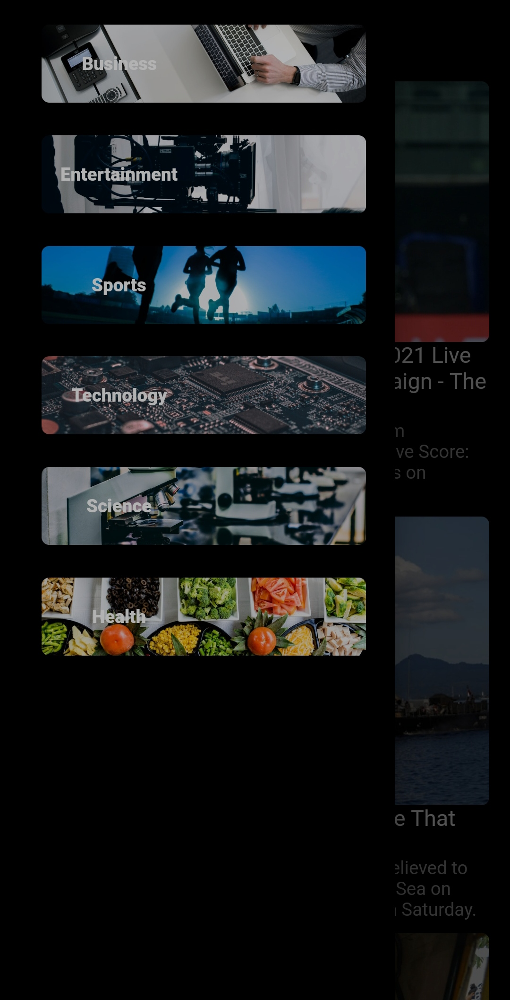

# Supr3me News
News app  

  

  
A cross-platform News app that compiles top articles from various news sources (using NewsApi.org), sorts them by their categorories and finally displays them on a single stage.

## Packages used:
  webview_flutter: ^2.0.4
  cached_network_image: ^3.0.0
  http: ^0.13.1

## Screenshots
       

## Getting Started

This project is a starting point for a Flutter application.

A few resources to get you started if this is your first Flutter project:

- [Lab: Write your first Flutter app](https://flutter.dev/docs/get-started/codelab)
- [Cookbook: Useful Flutter samples](https://flutter.dev/docs/cookbook)

For help getting started with Flutter, view our
[online documentation](https://flutter.dev/docs), which offers tutorials,
samples, guidance on mobile development, and a full API reference.
