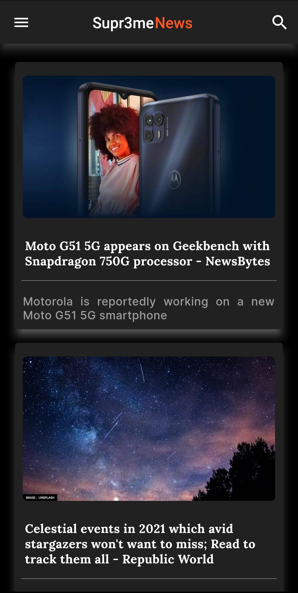
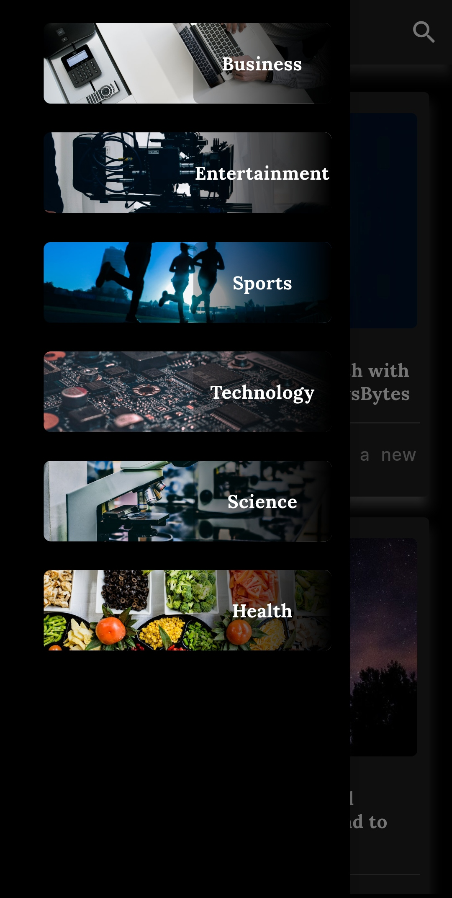
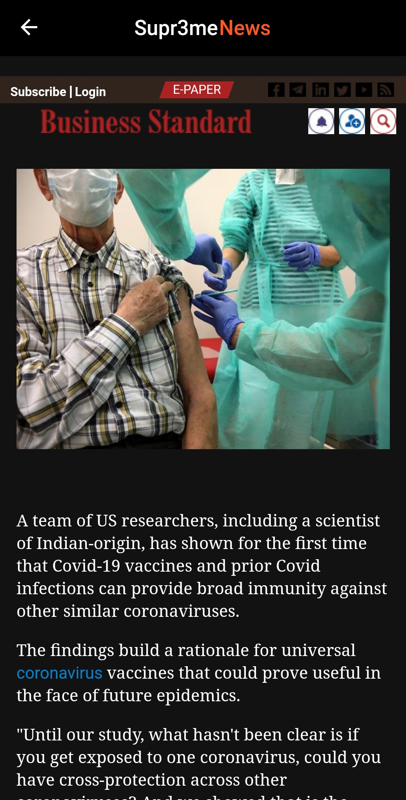
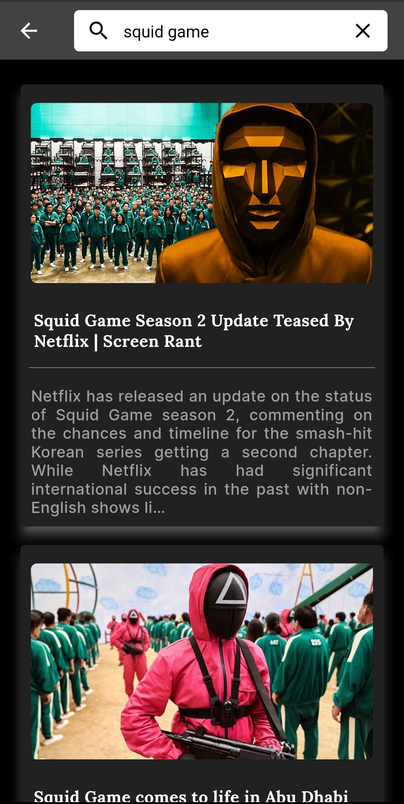

 

  

  <h1 align="center">Supr3me News</h1>
  

<a href="https://play.google.com/store/apps/details?id=com.news_app.supr3me_news">PlayStore link</a>
  

    A cross-platform News app that compiles top articles from various news sources (using NewsApi.org), sorts them by their categories and finally displays them on a single stage.
     
        
  

- [Built With](#built-with)
- [Packages used](#packages-used)
- [Features](#features)
- [Screenshots](#screenshots)
- [Contributing](#contributing)
  - [Creating A Pull Request](#creating-a-pull-request)
- [Authors](#authors)

## Built With

 
  

## Packages used
* webview_flutter: ^2.0.4  
* cached_network_image: ^3.0.0  
* http: ^0.13.1  
  
## Features
* Interactive UI
* News Updates 
* News Categories to choose from
* Quality news content  
* Dark Mode

## Screenshots
        

## Contributing

Contributions are what make the open source community such an amazing place to be learn, inspire, and create. Any contributions you make are **greatly appreciated**.
* If you have suggestions for adding or removing projects, feel free to [open an issue](https://github.com/Supr3me-code/Supr3meNews/issues/new) to discuss it.
* Please make sure to open an issue and discuss it before directly opening a pull request !
* Please make sure you check your spelling and grammar.

### Creating A Pull Request

1. Star this repository
2. Fork the repository
3. Clone the repository to your local machine
4. Make your desired changes to make the app better
5. Commit your changes
6. Push the changes to your remote branch
7. Raise a pull request with a description and visual screenshots of the changes
8. Wait for a while and your PR will be reviewed and hopefully get merged :)
